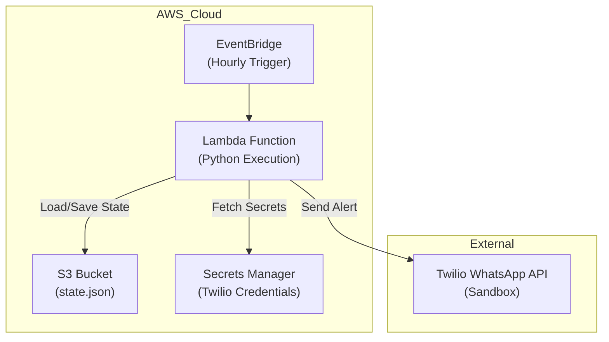

# AUD→INR Alert System (AWS Lambda + Twilio + S3 + Secrets Manager)

A fully serverless, automated alerting system that checks the AUD→INR exchange rate every hour and sends a WhatsApp notification when a threshold is crossed. The app guarantees **only 1 alert per day**, even if the rate keeps rising.

This project is built using AWS Lambda, EventBridge Scheduler, AWS Secrets Manager, S3, Python, and Twilio WhatsApp API.

---

## 🚀 Features

- Hourly Automated Checks using EventBridge Scheduler
- Live AUD→INR Exchange Rate Fetching
- WhatsApp Alerts via Twilio Sandbox
- 1 Alert Per Day Logic (prevents spam)
- S3-based Persistent State Management
- Credentials Secured with AWS Secrets Manager
- Fully Serverless Deployment (Zero Infrastructure Management)

---

## 🏗️ System Architecture

---

## 🛠️ Tech Stack

- Python 3  
- Twilio WhatsApp Sandbox API  
- fxratesapi.com (free exchange rate API)  
- python-dotenv  
- cron (optional automation)  

---

## Tech Used

- Python 3.12
- AWS Lambda
- AWS S3
- AWS Secrets Manager
- AWS EventBridge Scheduler
- Twilio WhatsApp Sandbox
- Requests + Boto3 Libraries

---

## Project Structure

    cash_converter_alert/
    │
    ├── alert.py                # Main Lambda handler
    ├── requirements.txt        # Dependencies
    └── state.json (local)      # Only for manual resets; not used by Lambda

---

## Secrets Management

        {
        "TWILIO_ACCOUNT_SID": "ACXXXXXXXXXXXXXXXXXXXXX",
        "TWILIO_AUTH_TOKEN": "your_auth_token_here"
        }

Lambda loads them dynamically at runtime using:

        import boto3
        import json
        import os

        def get_twilio_credentials():
            secrets_client = boto3.client("secretsmanager")
            secret_name = os.environ["TWILIO_SECRET_NAME"]
            response = secrets_client.get_secret_value(SecretId=secret_name)
            secrets = json.loads(response["SecretString"])
            return secrets["TWILIO_ACCOUNT_SID"], secrets["TWILIO_AUTH_TOKEN"]

---

## S3 State File

        {
        "last_alert_date": "2025-02-10"
        }

This ensures only one alert per day, even if the exchange rate continues rising.

---

## Deployment Steps

1. Install Dependencies
        pip install -r requirements.txt

2. Package Lambda Deployment
        cp alert.py lambda_package/
        cd lambda_package
        zip -r ../lambda_deploy.zip .
        cd ..

3. Upload to AWS Lambda Console
        Upload lambda_deploy.zip and set:

        Key	Value
        WHATSAPP_TO	whatsapp:+61XXXXXXXXX
        TWILIO_SECRET_NAME	cash_converter_twilio_credentials

## Scheduling with EventBridge

Create a rule:

    rate(1 hour)

Attach it to the Lambda function.

## WhatsApp Alerts

Messages are sent from Twilio Sandbox:
whatsapp:+14155238886

Example alert message:

🚨 AUD→INR Alert: Rate crossed 58. Current rate = 59.72

## Testing

Use the "Test" feature in AWS Lambda Console:
- Sends an alert if above threshold
- Updates S3 state automatically
- Ensures full pipeline integrity

## Future Enhancements

- Add multi-currency support
- Add Telegram/SMS notification options
- Expose dashboard via AWS CloudFront
- Add configurable thresholds via API Gateway
- Add daily summary notifications

### 👨‍💻 Author

Sujeeth Kumar Tuniki
Product Manager | Automation Enthusiast